# 🏗️ Tyra MCP Memory Server - System Architecture

## Overview

The Tyra MCP Memory Server is a sophisticated, locally-operated memory management system that transforms Cole's mem0 MCP server into an advanced temporal knowledge graph with hallucination detection, reranking capabilities, and self-learning analytics.

## 🎯 Core Design Principles

1. **100% Local Operation** - No external API dependencies
2. **Modular Provider System** - Hot-swappable components
3. **Temporal Knowledge Graphs** - Time-aware entity relationships
4. **Advanced RAG Pipeline** - Reranking and hallucination detection
5. **Self-Learning Capabilities** - Continuous improvement and optimization
6. **Rock-Solid Trading Safety** - 95%+ confidence requirements for financial operations
7. **Comprehensive Observability** - Full OpenTelemetry integration

## 🏛️ High-Level Architecture

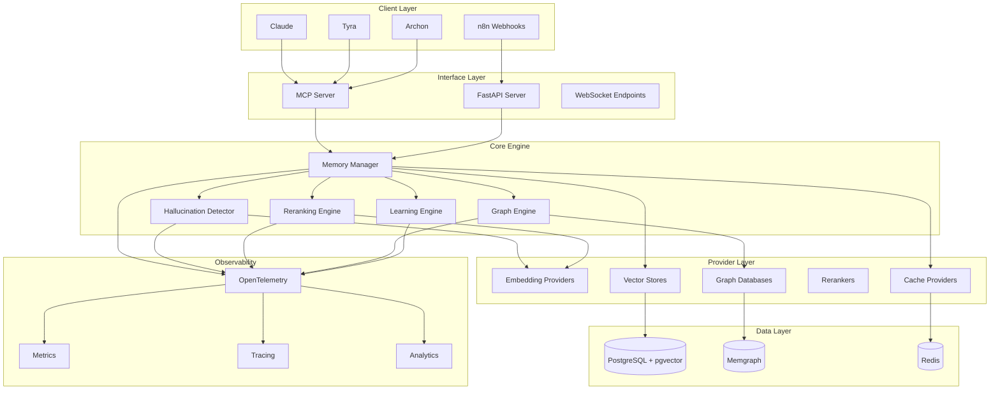

## 🔧 Component Architecture

### Memory Manager Core

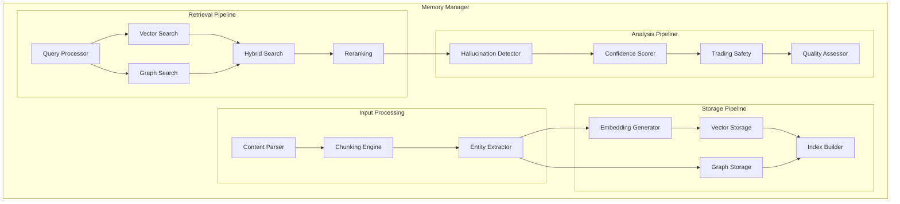

### Provider Registry System

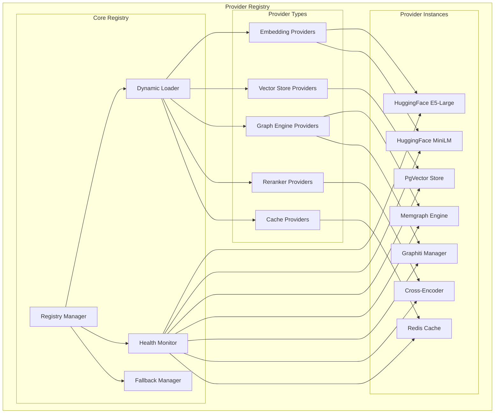

## 🧠 Advanced RAG Pipeline

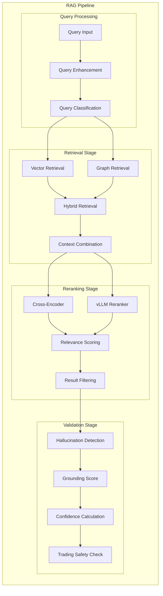

## 📄 Document Ingestion Pipeline

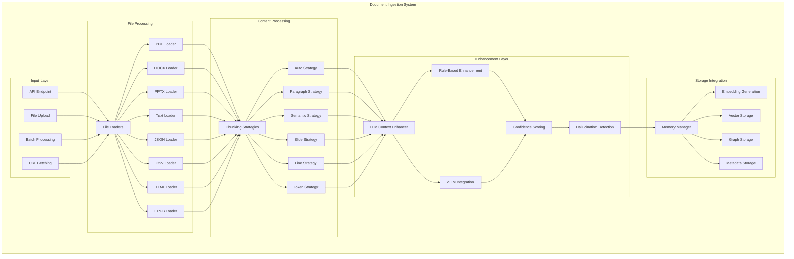

### Document Processing Features

#### Supported File Formats
- **PDF**: Portable Document Format with text extraction and metadata
- **DOCX**: Microsoft Word documents with paragraph and table detection
- **PPTX**: PowerPoint presentations with slide-based chunking
- **TXT/MD**: Plain text and Markdown with encoding detection
- **HTML**: Web pages with structure preservation
- **JSON**: Structured data with nested object handling
- **CSV**: Tabular data with header detection and streaming
- **EPUB**: E-books with chapter extraction

#### Dynamic Chunking Strategies
- **Auto Strategy**: Intelligent selection based on file type and content
- **Paragraph Strategy**: Groups logical paragraphs with size optimization
- **Semantic Strategy**: Topic boundary detection for coherent chunks
- **Slide Strategy**: PowerPoint slide grouping with speaker notes
- **Line Strategy**: Line-based chunking for structured data
- **Token Strategy**: Token-count-based chunking for precise control

#### LLM Enhancement Pipeline
- **Rule-Based Enhancement**: Fast context injection using predefined patterns
- **vLLM Integration**: Advanced context enhancement using local LLM models
- **Confidence Scoring**: Quality assessment of enhanced content
- **Hallucination Detection**: Validation of generated context against source

#### Processing Capabilities
- **Batch Processing**: Concurrent ingestion of multiple documents
- **Streaming Pipeline**: Efficient processing of large files (>10MB)
- **Error Recovery**: Graceful fallback for failed parsing attempts
- **Progress Tracking**: Real-time status updates for long operations
- **Metadata Extraction**: Comprehensive document and chunk metadata

## 🕸️ Temporal Knowledge Graph

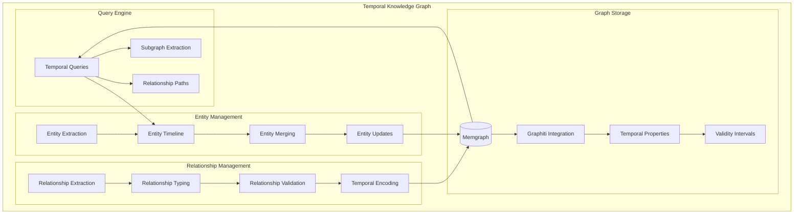

## 🤖 Self-Learning System

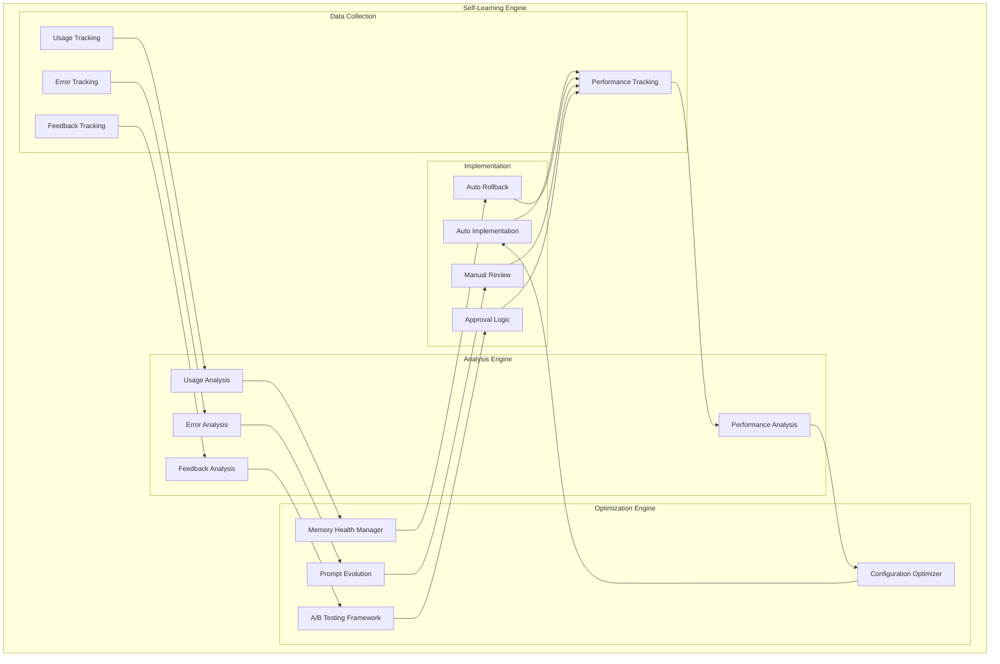

## 📊 Observability Architecture

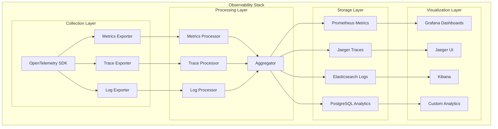

## 🔒 Security & Safety Architecture

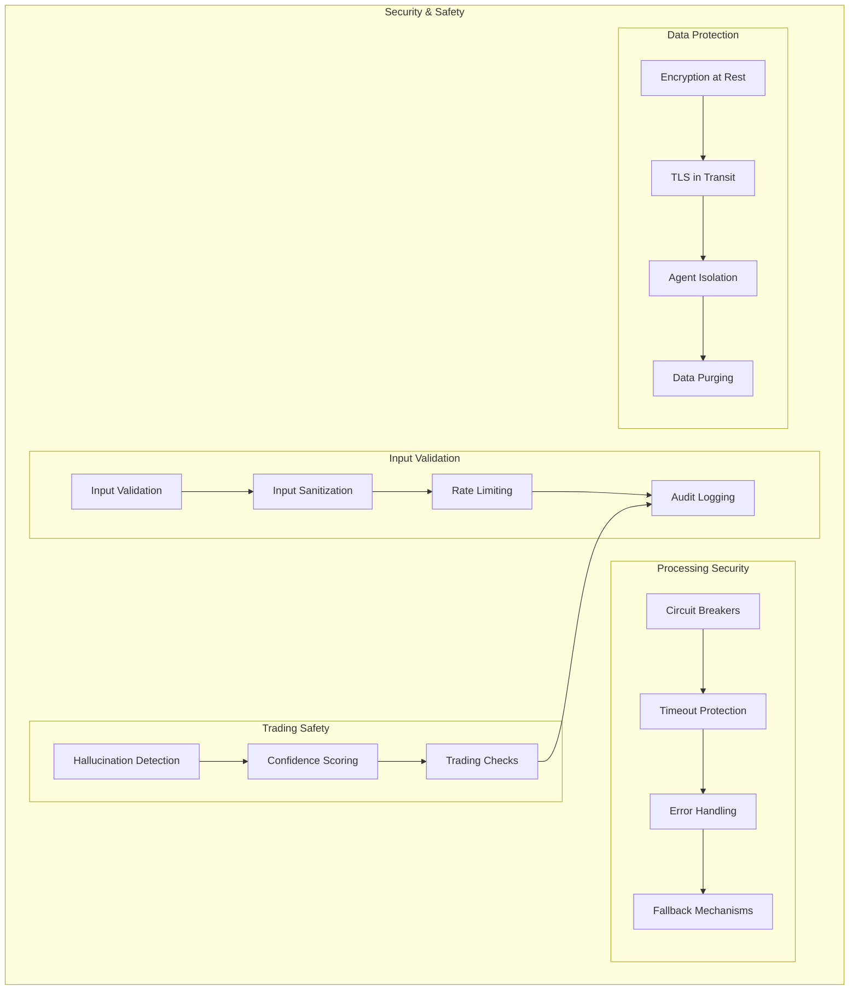

## 📁 Directory Structure

```
tyra-mcp-memory-server/
├── src/
│   ├── mcp/                    # MCP Server Implementation
│   │   ├── server.py          # Main MCP server
│   │   ├── tools.py           # MCP tool definitions
│   │   └── handlers.py        # Tool handlers
│   │
│   ├── api/                   # FastAPI Implementation
│   │   ├── app.py            # FastAPI application
│   │   ├── routes/           # API endpoints
│   │   │   ├── memory.py     # Memory operations
│   │   │   ├── search.py     # Search operations
│   │   │   ├── rag.py        # RAG operations
│   │   │   ├── chat.py       # Chat operations
│   │   │   ├── graph.py      # Graph operations
│   │   │   ├── admin.py      # Admin operations
│   │   │   ├── telemetry.py  # Telemetry operations
│   │   │   └── analytics.py  # Analytics operations
│   │   └── middleware.py     # API middleware
│   │
│   ├── core/                 # Core Business Logic
│   │   ├── memory/           # Memory Management
│   │   │   ├── manager.py    # Memory manager
│   │   │   ├── chunking.py   # Content chunking
│   │   │   └── indexing.py   # Index management
│   │   │
│   │   ├── rag/              # RAG Components
│   │   │   ├── retrieval.py  # Retrieval engine
│   │   │   ├── reranking.py  # Reranking system
│   │   │   └── hallucination_detector.py
│   │   │
│   │   ├── graph/            # Graph Components
│   │   │   ├── memgraph_client.py
│   │   │   └── graphiti_integration.py
│   │   │
│   │   ├── analytics/        # Analytics Components
│   │   │   ├── performance_tracker.py
│   │   │   ├── config_optimizer.py
│   │   │   └── memory_health.py
│   │   │
│   │   ├── adaptation/       # Self-Learning Components
│   │   │   ├── ab_testing.py
│   │   │   ├── learning_engine.py
│   │   │   ├── memory_health.py
│   │   │   ├── prompt_evolution.py
│   │   │   └── self_training_scheduler.py
│   │   │
│   │   ├── observability/    # Observability Components
│   │   │   ├── telemetry.py  # OpenTelemetry setup
│   │   │   ├── metrics.py    # Metrics collection
│   │   │   └── tracing.py    # Distributed tracing
│   │   │
│   │   ├── interfaces/       # Abstract Interfaces
│   │   │   ├── embeddings.py
│   │   │   ├── vector_store.py
│   │   │   ├── graph_engine.py
│   │   │   └── reranker.py
│   │   │
│   │   ├── providers/        # Provider Implementations
│   │   │   ├── embeddings/
│   │   │   │   ├── huggingface.py
│   │   │   │   └── registry.py
│   │   │   ├── vector_stores/
│   │   │   │   ├── pgvector.py
│   │   │   │   └── registry.py
│   │   │   ├── graph_engines/
│   │   │   │   ├── memgraph.py
│   │   │   │   └── registry.py
│   │   │   └── rerankers/
│   │   │       ├── cross_encoder.py
│   │   │       └── registry.py
│   │   │
│   │   ├── cache/            # Caching Layer
│   │   │   └── redis_cache.py
│   │   │
│   │   ├── agents/           # Agent Management
│   │   │   ├── session_manager.py
│   │   │   ├── claude_integration.py
│   │   │   └── agent_logger.py
│   │   │
│   │   └── utils/            # Utilities
│   │       ├── config.py     # Configuration management
│   │       ├── logger.py     # Logging utilities
│   │       ├── registry.py   # Provider registry
│   │       ├── database.py   # Database utilities
│   │       └── circuit_breaker.py
│   │
│   └── clients/              # Client Libraries
│       └── memory_client.py  # Python client library
│
├── config/                   # Configuration Files
│   ├── config.yaml          # Main configuration
│   ├── providers.yaml       # Provider configurations
│   ├── agents.yaml          # Agent configurations
│   ├── models.yaml          # Model configurations
│   ├── observability.yaml   # Observability configuration
│   └── self_learning.yaml   # Self-learning configuration
│
├── migrations/               # Database Migrations
│   ├── sql/                 # SQL schema migrations
│   │   ├── 001_initial_schema.sql
│   │   ├── 002_analytics_tables.sql
│   │   └── 003_self_learning_tables.sql
│   └── graph/               # Graph schema migrations
│       └── memgraph_schema.cypher
│
├── scripts/                  # Utility Scripts
│   ├── setup_databases.sh   # Database setup
│   ├── add_provider.py      # Add new providers
│   ├── migrate_config.py    # Configuration migration
│   └── performance_test.py  # Performance testing
│
├── tests/                    # Test Suite
│   ├── unit/                # Unit tests
│   ├── integration/         # Integration tests
│   └── performance/         # Performance tests
│
└── docs/                    # Documentation
    ├── api/                 # API documentation
    ├── providers/           # Provider documentation
    └── deployment/          # Deployment guides
```

## 🔄 Data Flow Architecture

### Memory Storage Flow

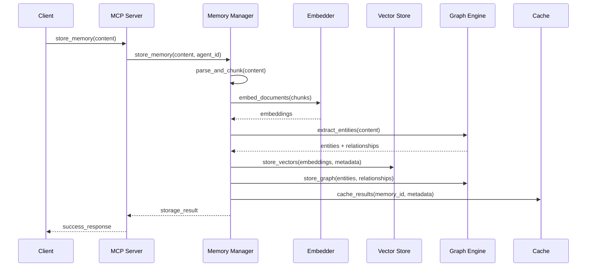

### Memory Search Flow

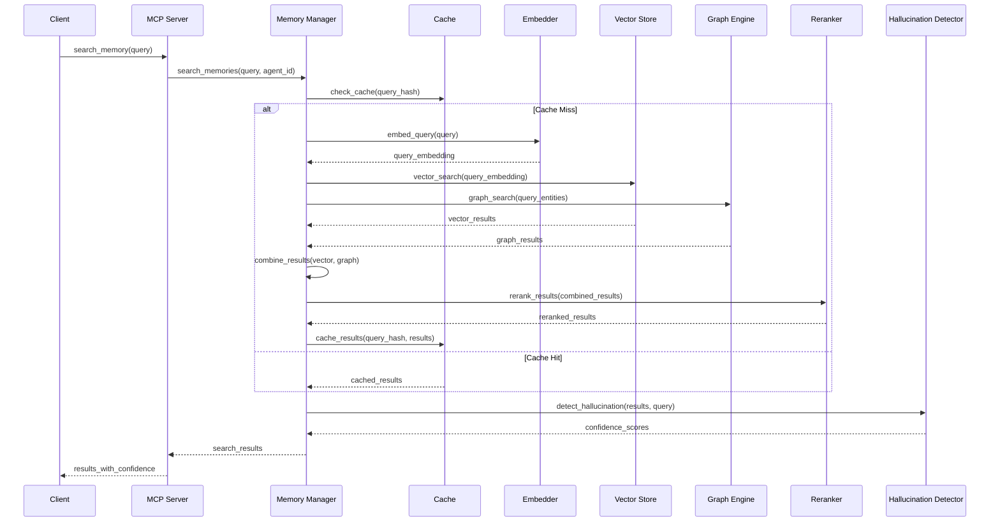

## ⚙️ Configuration Architecture

### Configuration Hierarchy

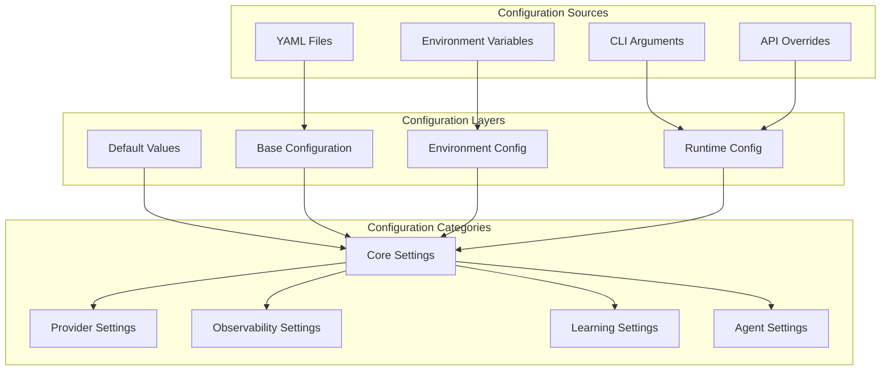

## 🚀 Deployment Architecture

### Local Development

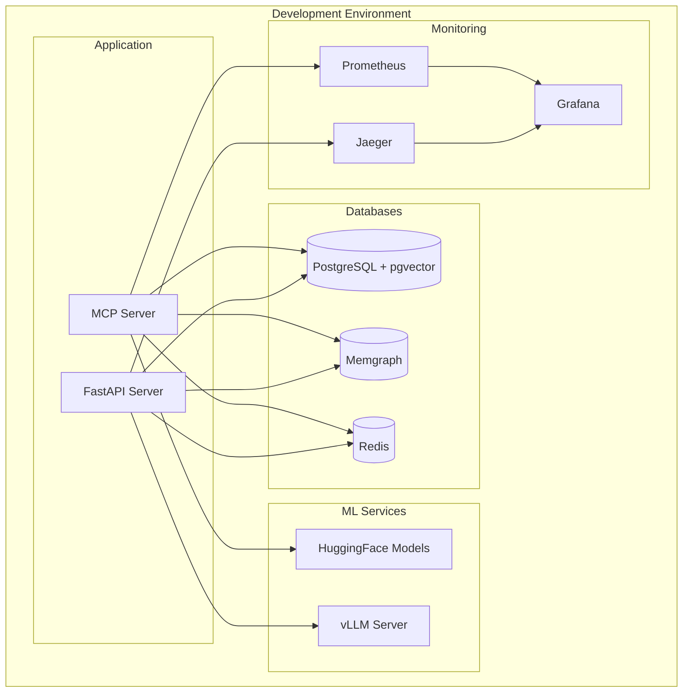

### Production Deployment

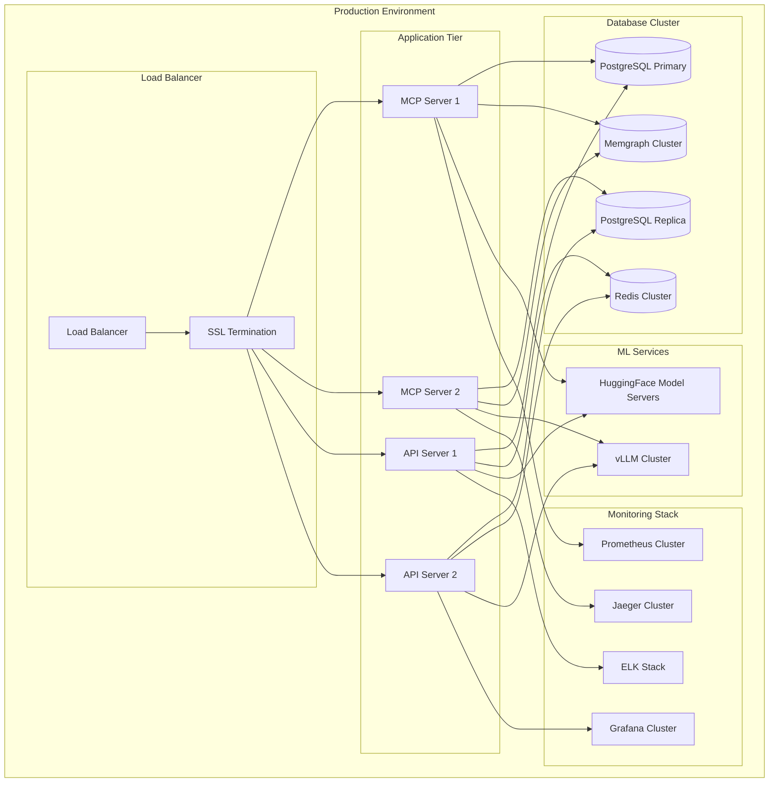

## 🔧 Technology Stack

### Core Technologies

| Component | Technology | Purpose |
|-----------|------------|---------|
| **MCP Server** | Python 3.11+ | Core MCP implementation |
| **FastAPI** | FastAPI + Uvicorn | REST API server |
| **Database** | PostgreSQL + pgvector | Vector storage |
| **Graph DB** | Memgraph | Knowledge graph |
| **Cache** | Redis | Multi-layer caching |
| **Embeddings** | HuggingFace Transformers | Local embeddings |
| **LLM** | vLLM | Local LLM serving |
| **Monitoring** | OpenTelemetry | Observability |

### Provider Ecosystem

| Type | Primary | Fallback | Purpose |
|------|---------|----------|---------|
| **Embeddings** | intfloat/e5-large-v2 | all-MiniLM-L12-v2 | Text embeddings |
| **Vector Store** | PostgreSQL + pgvector | - | Vector search |
| **Graph Engine** | Memgraph | - | Knowledge graph |
| **Graph Manager** | Graphiti | - | Temporal graphs |
| **Reranker** | Cross-encoder | vLLM | Result reranking |
| **Cache** | Redis | Memory | Performance |

## 📈 Performance Characteristics

### Latency Targets

| Operation | Target (p95) | Typical | Notes |
|-----------|--------------|---------|-------|
| **Memory Storage** | <200ms | <100ms | Including embedding |
| **Vector Search** | <50ms | <30ms | Top-20 results |
| **Hybrid Search** | <100ms | <60ms | Vector + graph |
| **Reranking** | <200ms | <120ms | 20 documents |
| **Hallucination Detection** | <300ms | <180ms | Full analysis |
| **Graph Query** | <100ms | <50ms | 2-hop traversal |

### Throughput Targets

| Metric | Target | Notes |
|--------|--------|-------|
| **Concurrent Users** | 100+ | Per server instance |
| **Queries/Second** | 50+ | Mixed workload |
| **Storage Rate** | 20/sec | New memories |
| **Cache Hit Rate** | >80% | For repeated queries |
| **Error Rate** | <0.1% | Excluding user errors |

## 🛡️ Reliability & Safety

### Circuit Breaker Configuration

```yaml
circuit_breakers:
  database:
    failure_threshold: 5
    recovery_timeout: 30s
    half_open_max_calls: 3
  
  embedding:
    failure_threshold: 3
    recovery_timeout: 60s
    half_open_max_calls: 2
  
  graph:
    failure_threshold: 5
    recovery_timeout: 30s
    half_open_max_calls: 3
```

### Trading Safety Guarantees

1. **Confidence Threshold**: Minimum 95% confidence for trading recommendations
2. **Hallucination Detection**: Comprehensive grounding verification
3. **Context Validation**: Ensures supporting evidence exists
4. **Audit Logging**: Complete audit trail for all trading-related operations
5. **Manual Override**: Safety checks can be bypassed only with explicit approval

## 🔮 Future Enhancements

### Planned Features

1. **Multi-Modal Support** - Image and audio memory integration
2. **Federated Learning** - Cross-instance knowledge sharing
3. **Advanced Analytics** - Predictive performance modeling
4. **Real-time Streaming** - Live memory updates
5. **Enhanced Security** - End-to-end encryption
6. **Model Fine-tuning** - Custom model adaptation
7. **Edge Deployment** - Lightweight edge instances

### Scalability Roadmap

1. **Horizontal Scaling** - Multi-instance deployment
2. **Sharding Strategy** - Data partitioning
3. **Async Processing** - Background job queues
4. **CDN Integration** - Global content delivery
5. **Auto-scaling** - Dynamic resource allocation

## 📚 Related Documentation

- [Installation Guide](INSTALLATION.md)
- [Configuration Reference](CONFIGURATION.md)
- [API Documentation](API.md)
- [Provider Guide](PROVIDERS.md)
- [Telemetry Setup](TELEMETRY.md)
- [Multi-Agent Patterns](MULTI_AGENT_PATTERNS.md)
- [Adding Providers](ADDING_PROVIDERS.md)

---

*This architecture document represents the current state and planned evolution of the Tyra MCP Memory Server. It's designed to be a living document that evolves with the system.*