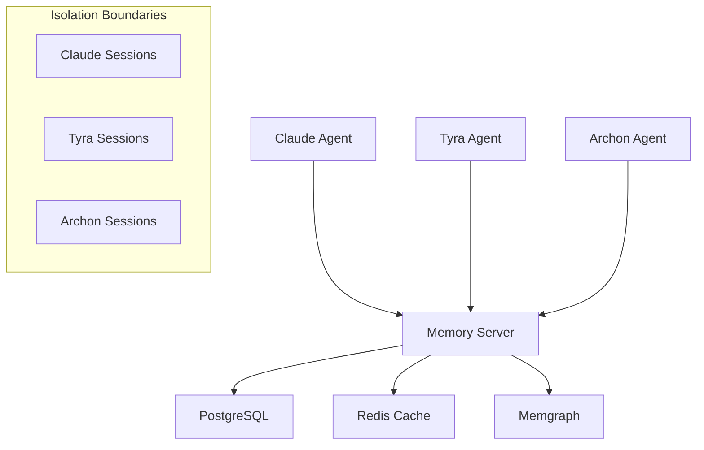
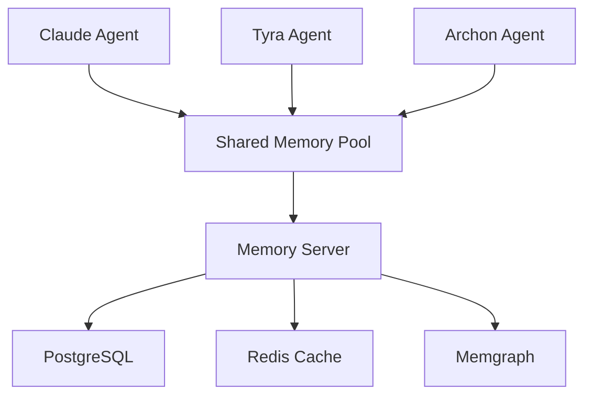
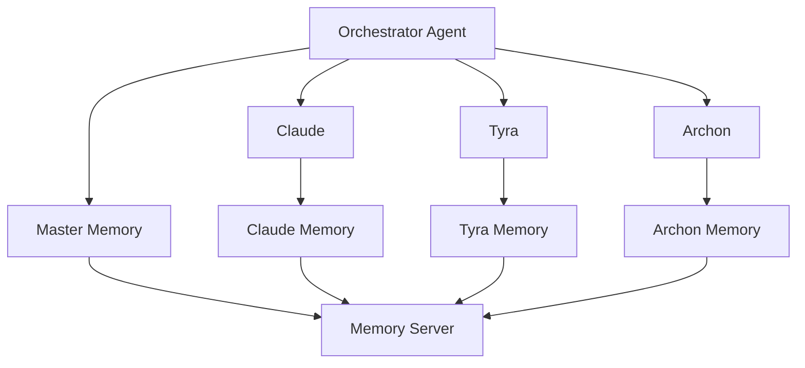

# 🤝 Multi-Agent Integration Patterns

## 📋 Overview

This guide covers advanced patterns for integrating multiple AI agents with the Tyra MCP Memory Server, including session isolation, agent coordination, memory sharing strategies, and conflict resolution.

## 🏗️ Architecture Patterns

### Pattern 1: Independent Agent Isolation



**Use Case**: Independent agents with separate memory spaces
**Benefits**: Maximum isolation, no cross-contamination
**Drawbacks**: No knowledge sharing between agents

```python
# Independent agent sessions
claude_session = await create_agent_session(
    agent_id="claude",
    user_id="user_001",
    metadata={"isolation_level": "strict"}
)

tyra_session = await create_agent_session(
    agent_id="tyra",
    user_id="user_001",
    metadata={"isolation_level": "strict"}
)

# Memories are completely isolated
await store_memory("Claude's analysis", agent_id="claude", session_id=claude_session.session_id)
await store_memory("Tyra's trading signal", agent_id="tyra", session_id=tyra_session.session_id)
```

### Pattern 2: Collaborative Knowledge Sharing



**Use Case**: Agents sharing knowledge while maintaining identity
**Benefits**: Cross-agent learning, collaborative intelligence
**Drawbacks**: Potential information contamination

```python
# Shared memory configuration
shared_config = {
    "memory_isolation_level": "none",
    "enable_cross_agent_memory": True,
    "shared_namespace": "collaborative_workspace"
}

# Store memory accessible to all agents
await store_memory(
    "Market analysis: Strong bullish momentum in tech sector",
    agent_id="claude",
    metadata={
        "shared": True,
        "accessible_to": ["tyra", "archon"],
        "knowledge_type": "market_analysis"
    }
)

# Tyra can access Claude's analysis
results = await search_memories(
    "tech sector bullish analysis",
    agent_id="tyra",
    include_shared=True
)
```

### Pattern 3: Hierarchical Agent Structure



**Use Case**: Coordinated multi-agent systems with central control
**Benefits**: Centralized coordination, hierarchical access control
**Drawbacks**: Single point of failure, complexity

```python
class AgentOrchestrator:
    def __init__(self):
        self.agents = {
            "claude": {"role": "analysis", "priority": 1},
            "tyra": {"role": "trading", "priority": 2},
            "archon": {"role": "coordination", "priority": 3}
        }

    async def coordinate_task(self, task_description):
        """Coordinate task across multiple agents."""

        # Store task in master memory
        task_memory = await store_memory(
            f"Coordination task: {task_description}",
            agent_id="orchestrator",
            metadata={
                "task_type": "coordination",
                "participating_agents": list(self.agents.keys()),
                "status": "initiated"
            }
        )

        # Delegate to appropriate agents
        results = {}
        for agent_id, config in self.agents.items():
            if self._should_participate(agent_id, task_description):
                result = await self._delegate_to_agent(agent_id, task_description, task_memory["memory_id"])
                results[agent_id] = result

        # Consolidate results
        consolidated = await self._consolidate_results(results, task_memory["memory_id"])
        return consolidated
```

## 🔄 Session Management Patterns

### Session Isolation Levels

```python
class SessionIsolationLevel:
    STRICT = "strict"          # Complete isolation
    AGENT = "agent"           # Shared within agent, isolated between agents
    USER = "user"             # Shared within user, isolated between users
    COLLABORATIVE = "collaborative"  # Shared across agents for same user
    GLOBAL = "global"         # Shared globally (use with caution)

# Configure session isolation
session_config = {
    "isolation_level": SessionIsolationLevel.COLLABORATIVE,
    "memory_sharing_rules": {
        "claude": ["analysis", "research"],
        "tyra": ["trading", "analysis"],
        "archon": ["coordination", "all"]
    }
}
```

### Cross-Session Communication

```python
async def setup_cross_session_communication():
    """Setup communication channels between agent sessions."""

    # Create shared communication channel
    comm_channel = await create_memory_namespace(
        namespace="agent_communication",
        accessibility="cross_agent",
        retention_policy="session_based"
    )

    return comm_channel

async def send_agent_message(from_agent, to_agent, message, context=None):
    """Send message between agents through memory system."""

    message_memory = await store_memory(
        f"Message from {from_agent} to {to_agent}: {message}",
        agent_id=from_agent,
        metadata={
            "message_type": "inter_agent_communication",
            "from_agent": from_agent,
            "to_agent": to_agent,
            "context": context or {},
            "timestamp": datetime.utcnow().isoformat(),
            "message_id": str(uuid.uuid4())
        },
        namespace="agent_communication"
    )

    # Notify target agent
    await notify_agent(to_agent, "new_message", message_memory["memory_id"])

    return message_memory
```

## 🧠 Memory Sharing Strategies

### Strategy 1: Tagged Memory Sharing

```python
class MemoryTags:
    PUBLIC = "public"
    PRIVATE = "private"
    SHARED_ANALYSIS = "shared_analysis"
    TRADING_SIGNALS = "trading_signals"
    COORDINATION = "coordination"

async def store_tagged_memory(content, agent_id, tags, accessibility=None):
    """Store memory with access tags."""

    return await store_memory(
        content,
        agent_id=agent_id,
        metadata={
            "tags": tags,
            "accessibility": accessibility or "agent_private",
            "sharing_rules": _get_sharing_rules(tags)
        }
    )

def _get_sharing_rules(tags):
    """Define sharing rules based on tags."""
    rules = {
        MemoryTags.PUBLIC: ["claude", "tyra", "archon"],
        MemoryTags.PRIVATE: [],
        MemoryTags.SHARED_ANALYSIS: ["claude", "tyra"],
        MemoryTags.TRADING_SIGNALS: ["tyra"],
        MemoryTags.COORDINATION: ["archon"]
    }

    accessible_agents = set()
    for tag in tags:
        accessible_agents.update(rules.get(tag, []))

    return {
        "accessible_to": list(accessible_agents),
        "requires_permission": tag in [MemoryTags.TRADING_SIGNALS]
    }
```

### Strategy 2: Contextual Memory Federation

```python
class MemoryFederation:
    """Federated memory access across agents with context awareness."""

    def __init__(self):
        self.context_rules = {
            "market_analysis": {
                "primary_agents": ["claude", "tyra"],
                "readonly_agents": ["archon"],
                "confidence_threshold": 0.8
            },
            "trading_execution": {
                "primary_agents": ["tyra"],
                "readonly_agents": ["claude", "archon"],
                "confidence_threshold": 0.95
            },
            "coordination": {
                "primary_agents": ["archon"],
                "readonly_agents": ["claude", "tyra"],
                "confidence_threshold": 0.7
            }
        }

    async def federated_search(self, query, requesting_agent, context_type):
        """Search across federated memories based on context."""

        rules = self.context_rules.get(context_type, {})

        # Determine accessible agents
        accessible_agents = []
        if requesting_agent in rules.get("primary_agents", []):
            accessible_agents = rules.get("primary_agents", []) + rules.get("readonly_agents", [])
        elif requesting_agent in rules.get("readonly_agents", []):
            accessible_agents = [requesting_agent]  # Limited access

        # Search across accessible agent memories
        all_results = []
        for agent_id in accessible_agents:
            results = await search_memories(
                query=query,
                agent_id=agent_id,
                min_confidence=rules.get("confidence_threshold", 0.5),
                include_metadata=True
            )

            # Tag results with source agent
            for result in results.get("results", []):
                result["source_agent"] = agent_id
                result["access_level"] = "primary" if agent_id in rules.get("primary_agents", []) else "readonly"

            all_results.extend(results.get("results", []))

        # Rerank and deduplicate
        federated_results = await self._rerank_federated_results(all_results, query)

        return {
            "success": True,
            "results": federated_results,
            "federation_context": context_type,
            "accessible_agents": accessible_agents
        }
```

## 🤖 Agent Coordination Patterns

### Pattern 1: Task-Based Coordination

```python
class TaskCoordinator:
    """Coordinate tasks across multiple agents."""

    async def execute_coordinated_task(self, task):
        """Execute a task requiring multiple agents."""

        # Create coordination memory
        coordination_id = await store_memory(
            f"Coordinated task: {task['description']}",
            agent_id="coordinator",
            metadata={
                "task_id": task["id"],
                "required_agents": task["agents"],
                "coordination_type": "sequential",  # or "parallel"
                "status": "initiated"
            }
        )

        results = {}

        if task["coordination_type"] == "sequential":
            # Sequential execution
            for agent_id in task["agents"]:
                result = await self._execute_agent_task(
                    agent_id,
                    task["subtasks"][agent_id],
                    coordination_id["memory_id"]
                )
                results[agent_id] = result

                # Share result with next agent
                if agent_id != task["agents"][-1]:
                    await self._share_intermediate_result(result, coordination_id["memory_id"])

        else:
            # Parallel execution
            tasks = [
                self._execute_agent_task(agent_id, task["subtasks"][agent_id], coordination_id["memory_id"])
                for agent_id in task["agents"]
            ]
            results_list = await asyncio.gather(*tasks)
            results = dict(zip(task["agents"], results_list))

        # Consolidate results
        final_result = await self._consolidate_task_results(results, coordination_id["memory_id"])

        return final_result
```

### Pattern 2: Event-Driven Coordination

```python
class EventDrivenCoordination:
    """Event-driven coordination between agents."""

    def __init__(self):
        self.event_handlers = {}
        self.agent_subscriptions = {}

    async def publish_event(self, event_type, data, source_agent):
        """Publish event to subscribed agents."""

        # Store event in memory
        event_memory = await store_memory(
            f"Event: {event_type} from {source_agent}",
            agent_id=source_agent,
            metadata={
                "event_type": event_type,
                "event_data": data,
                "source_agent": source_agent,
                "timestamp": datetime.utcnow().isoformat(),
                "subscribers": self.agent_subscriptions.get(event_type, [])
            }
        )

        # Notify subscribed agents
        subscribers = self.agent_subscriptions.get(event_type, [])
        for agent_id in subscribers:
            await self._notify_agent_of_event(agent_id, event_memory)

        return event_memory

    async def subscribe_agent(self, agent_id, event_types):
        """Subscribe agent to event types."""
        for event_type in event_types:
            if event_type not in self.agent_subscriptions:
                self.agent_subscriptions[event_type] = []
            self.agent_subscriptions[event_type].append(agent_id)

        # Store subscription in memory
        await store_memory(
            f"Agent {agent_id} subscribed to events: {event_types}",
            agent_id="coordinator",
            metadata={
                "subscription_type": "event_subscription",
                "agent_id": agent_id,
                "event_types": event_types
            }
        )

# Example usage
coordinator = EventDrivenCoordination()

# Setup subscriptions
await coordinator.subscribe_agent("tyra", ["market_signal", "risk_alert"])
await coordinator.subscribe_agent("claude", ["analysis_request", "research_needed"])
await coordinator.subscribe_agent("archon", ["coordination_needed", "task_completed"])

# Publish events
await coordinator.publish_event(
    "market_signal",
    {"symbol": "AAPL", "signal": "bullish", "confidence": 0.89},
    "tyra"
)
```

## 🔒 Access Control and Security

### Multi-Agent Authentication

```python
class MultiAgentAuth:
    """Authentication and authorization for multi-agent systems."""

    def __init__(self):
        self.agent_permissions = {
            "claude": {
                "memory_access": ["read", "write"],
                "agent_communication": ["send", "receive"],
                "coordination": ["participate"],
                "restricted_operations": []
            },
            "tyra": {
                "memory_access": ["read", "write"],
                "agent_communication": ["send", "receive"],
                "coordination": ["participate"],
                "restricted_operations": ["high_confidence_trading"]
            },
            "archon": {
                "memory_access": ["read", "write", "admin"],
                "agent_communication": ["send", "receive", "broadcast"],
                "coordination": ["initiate", "participate", "terminate"],
                "restricted_operations": ["system_admin"]
            }
        }

    async def authorize_action(self, agent_id, action, context=None):
        """Authorize agent action based on permissions."""

        permissions = self.agent_permissions.get(agent_id, {})

        # Check basic permissions
        if action in ["read_memory", "write_memory"]:
            required_perm = action.replace("_memory", "")
            if required_perm not in permissions.get("memory_access", []):
                return False

        # Check context-specific permissions
        if context and context.get("confidence_required", 0) >= 0.95:
            if "high_confidence_trading" not in permissions.get("restricted_operations", []):
                return False

        # Log authorization
        await store_memory(
            f"Authorization: {agent_id} {action}",
            agent_id="security",
            metadata={
                "authorization_event": True,
                "agent_id": agent_id,
                "action": action,
                "authorized": True,
                "context": context or {}
            }
        )

        return True
```

### Memory Encryption for Sensitive Data

```python
class SecureMemoryHandler:
    """Handle sensitive memories with encryption."""

    def __init__(self, encryption_key):
        self.encryption_key = encryption_key

    async def store_sensitive_memory(self, content, agent_id, sensitivity_level="high"):
        """Store sensitive memory with encryption."""

        if sensitivity_level in ["high", "critical"]:
            # Encrypt sensitive content
            encrypted_content = self._encrypt_content(content)

            # Store with encryption metadata
            result = await store_memory(
                encrypted_content,
                agent_id=agent_id,
                metadata={
                    "encrypted": True,
                    "sensitivity_level": sensitivity_level,
                    "encryption_algorithm": "AES-256",
                    "requires_decryption": True,
                    "access_log": True
                }
            )
        else:
            # Store normally for low sensitivity
            result = await store_memory(content, agent_id=agent_id)

        return result

    def _encrypt_content(self, content):
        """Encrypt content using configured algorithm."""
        # Implementation would use actual encryption library
        return f"ENCRYPTED:{content}"  # Placeholder
```

## 📊 Performance Optimization

### Load Balancing Across Agents

```python
class AgentLoadBalancer:
    """Balance load across multiple agent instances."""

    def __init__(self):
        self.agent_load = {}
        self.agent_capabilities = {}

    async def route_request(self, request_type, request_data):
        """Route request to best available agent."""

        # Find capable agents
        capable_agents = [
            agent_id for agent_id, capabilities in self.agent_capabilities.items()
            if request_type in capabilities
        ]

        if not capable_agents:
            raise ValueError(f"No agents capable of handling {request_type}")

        # Select agent with lowest load
        selected_agent = min(capable_agents, key=lambda x: self.agent_load.get(x, 0))

        # Update load tracking
        self.agent_load[selected_agent] = self.agent_load.get(selected_agent, 0) + 1

        # Log routing decision
        await store_memory(
            f"Request routed to {selected_agent}",
            agent_id="load_balancer",
            metadata={
                "request_type": request_type,
                "selected_agent": selected_agent,
                "current_load": self.agent_load[selected_agent],
                "available_agents": capable_agents
            }
        )

        return selected_agent
```

## 🔄 Conflict Resolution

### Memory Conflict Resolution

```python
class MemoryConflictResolver:
    """Resolve conflicts between agent memories."""

    async def resolve_conflict(self, conflicting_memories):
        """Resolve conflicts between memories from different agents."""

        # Analyze confidence scores
        highest_confidence = max(mem["confidence"] for mem in conflicting_memories)

        # Check agent authority on topic
        authority_scores = {}
        for memory in conflicting_memories:
            authority_scores[memory["agent_id"]] = self._get_agent_authority(
                memory["agent_id"],
                memory["metadata"].get("topic")
            )

        # Resolution strategy
        if highest_confidence > 0.95:
            # Trust highest confidence
            resolution = "confidence_based"
            winner = max(conflicting_memories, key=lambda x: x["confidence"])
        else:
            # Use agent authority
            resolution = "authority_based"
            winner_agent = max(authority_scores.keys(), key=lambda x: authority_scores[x])
            winner = next(mem for mem in conflicting_memories if mem["agent_id"] == winner_agent)

        # Store resolution
        await store_memory(
            f"Conflict resolved: {resolution}",
            agent_id="conflict_resolver",
            metadata={
                "resolution_type": resolution,
                "conflicting_memories": [mem["id"] for mem in conflicting_memories],
                "winning_memory": winner["id"],
                "resolution_confidence": winner["confidence"]
            }
        )

        return winner
```

## 📈 Monitoring and Analytics

### Multi-Agent Performance Monitoring

```python
class MultiAgentMonitor:
    """Monitor performance across multiple agents."""

    async def collect_agent_metrics(self):
        """Collect performance metrics for all agents."""

        metrics = {}

        for agent_id in ["claude", "tyra", "archon"]:
            agent_metrics = await self._collect_single_agent_metrics(agent_id)
            metrics[agent_id] = agent_metrics

        # Cross-agent metrics
        metrics["cross_agent"] = {
            "collaboration_events": await self._count_collaboration_events(),
            "conflict_resolution_events": await self._count_conflict_resolutions(),
            "shared_memory_usage": await self._measure_shared_memory_usage()
        }

        return metrics

    async def generate_collaboration_report(self):
        """Generate report on agent collaboration patterns."""

        collaboration_data = await search_memories(
            "agent collaboration coordination communication",
            agent_id="all",
            time_range="last_24h"
        )

        return {
            "collaboration_frequency": len(collaboration_data["results"]),
            "most_collaborative_agents": self._analyze_collaboration_patterns(collaboration_data),
            "efficiency_metrics": await self._calculate_efficiency_metrics(),
            "recommendations": self._generate_collaboration_recommendations()
        }
```

## 📚 Best Practices

### 1. Session Management
- Use appropriate isolation levels for your use case
- Implement session cleanup to prevent resource leaks
- Monitor session counts and durations

### 2. Memory Sharing
- Define clear sharing rules and permissions
- Use tags and metadata for access control
- Implement audit trails for sensitive data access

### 3. Agent Coordination
- Choose coordination patterns based on task requirements
- Implement timeouts for coordination operations
- Use event-driven patterns for real-time coordination

### 4. Conflict Resolution
- Define authority hierarchies for different domains
- Use confidence scores as primary resolution mechanism
- Log all conflict resolution decisions

### 5. Performance
- Implement load balancing for high-traffic scenarios
- Use caching strategically for shared data
- Monitor cross-agent communication overhead

---

🤝 **Multi-Agent Integration Complete!** Your memory server now supports sophisticated multi-agent patterns with proper isolation, coordination, and conflict resolution.
