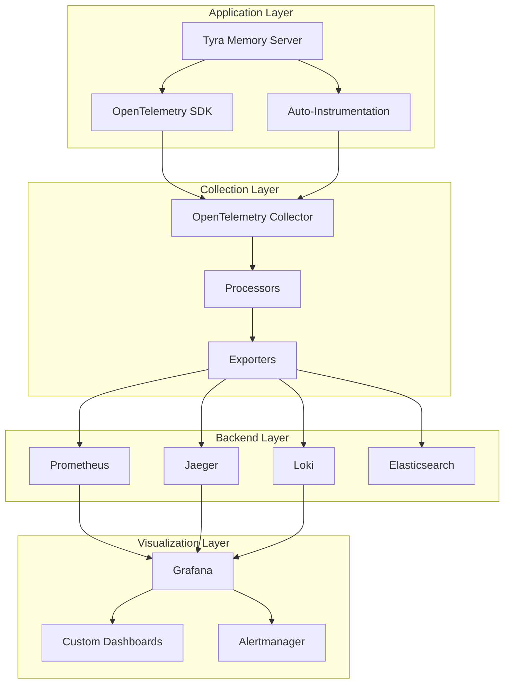

# 📈 Tyra MCP Memory Server - Telemetry & Observability

## 📋 Table of Contents

- [Overview](#overview)
- [OpenTelemetry Integration](#opentelemetry-integration)
- [Metrics Collection](#metrics-collection)
- [Distributed Tracing](#distributed-tracing)
- [Logging System](#logging-system)
- [Performance Monitoring](#performance-monitoring)
- [Alerting & Notifications](#alerting--notifications)
- [Dashboard Setup](#dashboard-setup)
- [Self-Learning Analytics](#self-learning-analytics)
- [Troubleshooting](#troubleshooting)
- [Best Practices](#best-practices)

## 🎯 Overview

The Tyra MCP Memory Server includes comprehensive observability through OpenTelemetry, providing deep insights into system performance, user interactions, and quality metrics. This enables proactive monitoring, debugging, and continuous optimization.

### Key Features

- **OpenTelemetry Standards**: Industry-standard observability
- **Multi-Signal Collection**: Traces, metrics, and logs
- **Real-time Analytics**: Live performance monitoring
- **Self-Learning Integration**: Automated system optimization
- **Multi-Backend Support**: Prometheus, Jaeger, Grafana, and more
- **Zero-Code Instrumentation**: Automatic telemetry collection

## 🔧 OpenTelemetry Integration

### Architecture Overview



### Configuration

#### Basic Setup

```yaml
# config/observability.yaml
observability:
  enabled: true
  
  # OpenTelemetry Configuration
  otel:
    service_name: "tyra-memory-server"
    service_version: "1.0.0"
    environment: "production"
    
    # Instrumentation
    auto_instrumentation:
      enabled: true
      
    # Resource attributes
    resource:
      service.name: "tyra-memory-server"
      service.namespace: "ai-memory"
      service.version: "1.0.0"
      deployment.environment: "${ENVIRONMENT:-production}"
      
  # Tracing Configuration
  tracing:
    enabled: true
    sampler: "parentbased_traceidratio"
    sample_rate: 1.0  # 100% sampling in development
    max_queue_size: 2048
    max_export_batch_size: 512
    export_timeout_millis: 30000
    
    # Exporters
    exporters:
      console:
        enabled: false
      jaeger:
        enabled: true
        endpoint: "${JAEGER_ENDPOINT:-http://localhost:14268/api/traces}"
      zipkin:
        enabled: false
        endpoint: "${ZIPKIN_ENDPOINT:-http://localhost:9411/api/v2/spans}"
        
  # Metrics Configuration  
  metrics:
    enabled: true
    collection_interval: 5000  # 5 seconds
    
    # Exporters
    exporters:
      console:
        enabled: false
      prometheus:
        enabled: true
        endpoint: "${PROMETHEUS_ENDPOINT:-http://localhost:9090}"
        host: "0.0.0.0"
        port: 8889
        
  # Logging Configuration
  logging:
    enabled: true
    level: "INFO"
    
    # Correlation
    trace_correlation: true
    include_trace_id: true
    include_span_id: true
    
    # Exporters
    exporters:
      console:
        enabled: true
      file:
        enabled: true
        path: "logs/telemetry.log"
      loki:
        enabled: false
        endpoint: "${LOKI_ENDPOINT:-http://localhost:3100}"
```

#### Advanced Configuration

```yaml
# config/observability.yaml (continued)
observability:
  # Custom Instrumentation
  instrumentation:
    # Memory operations
    memory_operations:
      enabled: true
      include_request_body: false  # Security consideration
      include_response_body: false
      
    # Database operations
    database_operations:
      enabled: true
      include_query: true
      include_parameters: false  # Security consideration
      
    # Provider operations
    provider_operations:
      enabled: true
      include_model_info: true
      
    # Cache operations
    cache_operations:
      enabled: true
      include_keys: false  # Security consideration
      
  # Sampling Configuration
  sampling:
    # Production settings
    production:
      default_sample_rate: 0.1  # 10% sampling
      error_sample_rate: 1.0    # 100% for errors
      slow_operation_rate: 1.0  # 100% for slow operations
      
    # Development settings
    development:
      default_sample_rate: 1.0  # 100% sampling
      
  # Batch Processing
  batching:
    traces:
      max_queue_size: 2048
      max_export_batch_size: 512
      export_timeout: 30s
      
    metrics:
      max_queue_size: 2048
      export_timeout: 60s
```

### Implementation

#### Core Setup (`src/core/observability/telemetry.py`)

```python
from opentelemetry import trace, metrics
from opentelemetry.exporter.jaeger.thrift import JaegerExporter
from opentelemetry.exporter.prometheus import PrometheusMetricReader
from opentelemetry.instrumentation.auto_instrumentation import autoinstrument
from opentelemetry.sdk.trace import TracerProvider
from opentelemetry.sdk.metrics import MeterProvider

class TelemetryManager:
    """Manages OpenTelemetry setup and instrumentation."""
    
    def __init__(self, config: Dict[str, Any]):
        self.config = config
        self.tracer_provider = None
        self.meter_provider = None
        
    async def initialize(self):
        """Initialize OpenTelemetry components."""
        # Setup tracing
        if self.config.get("tracing", {}).get("enabled", True):
            self._setup_tracing()
            
        # Setup metrics
        if self.config.get("metrics", {}).get("enabled", True):
            self._setup_metrics()
            
        # Auto-instrumentation
        if self.config.get("auto_instrumentation", {}).get("enabled", True):
            autoinstrument()
            
    def _setup_tracing(self):
        """Configure distributed tracing."""
        # Create tracer provider
        self.tracer_provider = TracerProvider(
            resource=self._create_resource()
        )
        
        # Add span processors and exporters
        exporters = self.config.get("tracing", {}).get("exporters", {})
        
        if exporters.get("jaeger", {}).get("enabled", False):
            jaeger_exporter = JaegerExporter(
                endpoint=exporters["jaeger"]["endpoint"]
            )
            self.tracer_provider.add_span_processor(
                BatchSpanProcessor(jaeger_exporter)
            )
            
        trace.set_tracer_provider(self.tracer_provider)
        
    def _setup_metrics(self):
        """Configure metrics collection."""
        readers = []
        
        exporters = self.config.get("metrics", {}).get("exporters", {})
        
        if exporters.get("prometheus", {}).get("enabled", False):
            prometheus_reader = PrometheusMetricReader()
            readers.append(prometheus_reader)
            
        self.meter_provider = MeterProvider(
            resource=self._create_resource(),
            metric_readers=readers
        )
        
        metrics.set_meter_provider(self.meter_provider)
```

## 📊 Metrics Collection

### Core Metrics Categories

#### Performance Metrics

```python
# src/core/observability/metrics.py
from opentelemetry import metrics

meter = metrics.get_meter(__name__)

# Latency metrics
memory_operation_latency = meter.create_histogram(
    name="memory_operation_duration_ms",
    description="Duration of memory operations in milliseconds",
    unit="ms"
)

# Throughput metrics
memory_operations_total = meter.create_counter(
    name="memory_operations_total",
    description="Total number of memory operations"
)

# Quality metrics
confidence_score = meter.create_histogram(
    name="memory_confidence_score",
    description="Confidence scores for memory operations",
    unit="score"
)

# Resource metrics
gpu_memory_usage = meter.create_gauge(
    name="gpu_memory_usage_bytes",
    description="GPU memory usage in bytes",
    unit="bytes"
)
```

#### Business Metrics

```python
# Agent interaction metrics
agent_requests = meter.create_counter(
    name="agent_requests_total",
    description="Total requests by agent",
    unit="requests"
)

# Search effectiveness
search_relevance = meter.create_histogram(
    name="search_relevance_score",
    description="Search result relevance scores",
    unit="score"
)

# Hallucination detection
hallucination_rate = meter.create_histogram(
    name="hallucination_detection_rate",
    description="Rate of detected hallucinations",
    unit="rate"
)
```

### Custom Metrics Implementation

```python
# src/core/observability/custom_metrics.py
class MemoryMetrics:
    """Custom metrics for memory operations."""
    
    def __init__(self):
        self.meter = metrics.get_meter(__name__)
        self._init_instruments()
        
    def _init_instruments(self):
        """Initialize metric instruments."""
        # Counters
        self.memory_stores = self.meter.create_counter(
            "memory_stores_total",
            description="Total memory store operations"
        )
        
        self.memory_searches = self.meter.create_counter(
            "memory_searches_total", 
            description="Total memory search operations"
        )
        
        # Histograms
        self.store_latency = self.meter.create_histogram(
            "memory_store_duration_ms",
            description="Memory store operation latency"
        )
        
        self.search_latency = self.meter.create_histogram(
            "memory_search_duration_ms",
            description="Memory search operation latency"
        )
        
        # Gauges
        self.active_memories = self.meter.create_up_down_counter(
            "active_memories_count",
            description="Number of active memories in system"
        )
        
    def record_store_operation(self, duration_ms: float, agent_id: str, success: bool):
        """Record memory store operation metrics."""
        labels = {
            "agent_id": agent_id,
            "operation": "store",
            "status": "success" if success else "error"
        }
        
        self.memory_stores.add(1, labels)
        self.store_latency.record(duration_ms, labels)
        
    def record_search_operation(self, duration_ms: float, agent_id: str, 
                               result_count: int, confidence: float):
        """Record memory search operation metrics."""
        labels = {
            "agent_id": agent_id,
            "operation": "search",
            "result_count_bucket": self._get_count_bucket(result_count)
        }
        
        self.memory_searches.add(1, labels)
        self.search_latency.record(duration_ms, labels)
        
        # Record confidence distribution
        confidence_labels = {**labels, "confidence_level": self._get_confidence_level(confidence)}
        self.meter.create_histogram("search_confidence").record(confidence, confidence_labels)
```

## 🔍 Distributed Tracing

### Automatic Instrumentation

The system automatically traces:

- **HTTP Requests**: FastAPI endpoints
- **Database Operations**: PostgreSQL, Redis, Memgraph
- **External Calls**: Model inference, API calls
- **Internal Operations**: Memory management, RAG pipeline

### Custom Spans

```python
# src/core/observability/tracing.py
from opentelemetry import trace
from opentelemetry.trace import Status, StatusCode

tracer = trace.get_tracer(__name__)

class MemoryTracing:
    """Custom tracing for memory operations."""
    
    @staticmethod
    def trace_memory_operation(operation_name: str):
        """Decorator for tracing memory operations."""
        def decorator(func):
            async def wrapper(*args, **kwargs):
                with tracer.start_as_current_span(operation_name) as span:
                    # Add operation attributes
                    span.set_attribute("memory.operation", operation_name)
                    span.set_attribute("memory.agent_id", kwargs.get("agent_id", "unknown"))
                    
                    try:
                        result = await func(*args, **kwargs)
                        
                        # Record success attributes
                        span.set_attribute("memory.success", True)
                        if hasattr(result, '__len__'):
                            span.set_attribute("memory.result_count", len(result))
                            
                        span.set_status(Status(StatusCode.OK))
                        return result
                        
                    except Exception as e:
                        # Record error attributes
                        span.set_attribute("memory.success", False)
                        span.set_attribute("memory.error", str(e))
                        span.set_status(Status(StatusCode.ERROR, str(e)))
                        raise
                        
            return wrapper
        return decorator

# Usage example
@MemoryTracing.trace_memory_operation("memory.search")
async def search_memory(query: str, agent_id: str = None):
    # Implementation here
    pass
```

### Advanced Tracing

```python
# Context propagation and custom attributes
from opentelemetry.baggage import set_baggage
from opentelemetry.trace import get_current_span

async def enhanced_memory_search(request: MemorySearchRequest):
    """Enhanced search with detailed tracing."""
    span = get_current_span()
    
    # Add comprehensive attributes
    span.set_attributes({
        "memory.query_length": len(request.query),
        "memory.search_type": request.search_type,
        "memory.top_k": request.top_k,
        "memory.min_confidence": request.min_confidence,
        "memory.agent_id": request.agent_id,
        "memory.session_id": request.session_id
    })
    
    # Set baggage for downstream services
    set_baggage("agent.id", request.agent_id)
    set_baggage("search.type", request.search_type)
    
    # Create child spans for major operations
    with tracer.start_as_current_span("embedding.generation") as embed_span:
        embeddings = await generate_embeddings(request.query)
        embed_span.set_attribute("embedding.dimensions", len(embeddings))
        
    with tracer.start_as_current_span("vector.search") as vector_span:
        vector_results = await vector_search(embeddings, request.top_k)
        vector_span.set_attribute("vector.results_count", len(vector_results))
        
    with tracer.start_as_current_span("graph.search") as graph_span:
        graph_results = await graph_search(request.query)
        graph_span.set_attribute("graph.results_count", len(graph_results))
        
    # Record final results
    span.set_attributes({
        "memory.total_results": len(vector_results) + len(graph_results),
        "memory.search_success": True
    })
```

## 📝 Logging System

### Structured Logging

```python
# src/core/utils/logger.py
import structlog
from opentelemetry import trace

def get_logger(name: str):
    """Get structured logger with OpenTelemetry integration."""
    return structlog.get_logger(name).bind(
        service="tyra-memory-server",
        version="1.0.0"
    )

# Usage with trace correlation
logger = get_logger(__name__)

async def memory_operation():
    span = trace.get_current_span()
    span_context = span.get_span_context()
    
    # Automatically include trace information
    logger.info(
        "Memory operation started",
        trace_id=format(span_context.trace_id, "032x"),
        span_id=format(span_context.span_id, "016x"),
        operation="store_memory",
        agent_id="tyra"
    )
```

### Log Configuration

```yaml
# config/config.yaml
logging:
  level: INFO
  format: "json"
  
  # Trace correlation
  include_trace_id: true
  include_span_id: true
  
  # Output destinations
  outputs:
    console:
      enabled: true
      level: INFO
      format: "%(asctime)s [%(levelname)s] %(name)s: %(message)s"
      
    file:
      enabled: true
      level: DEBUG
      path: "logs/tyra-memory.log"
      max_size: "100MB"
      backup_count: 5
      format: "json"
      
    loki:
      enabled: false
      endpoint: "http://localhost:3100"
      labels:
        service: "tyra-memory-server"
        environment: "production"
```

## 📈 Performance Monitoring

### Real-time Dashboards

#### System Health Dashboard

```json
{
  "dashboard": {
    "title": "Tyra Memory Server - System Health",
    "panels": [
      {
        "title": "Request Rate",
        "targets": [
          {
            "expr": "rate(memory_operations_total[5m])",
            "legend": "Operations/sec"
          }
        ]
      },
      {
        "title": "Response Latency",
        "targets": [
          {
            "expr": "histogram_quantile(0.95, memory_operation_duration_ms_bucket)",
            "legend": "95th percentile"
          },
          {
            "expr": "histogram_quantile(0.50, memory_operation_duration_ms_bucket)",
            "legend": "50th percentile"
          }
        ]
      },
      {
        "title": "Error Rate", 
        "targets": [
          {
            "expr": "rate(memory_operations_total{status=\"error\"}[5m]) / rate(memory_operations_total[5m])",
            "legend": "Error Rate %"
          }
        ]
      }
    ]
  }
}
```

#### Quality Metrics Dashboard

```json
{
  "dashboard": {
    "title": "Tyra Memory Server - Quality Metrics",
    "panels": [
      {
        "title": "Confidence Score Distribution",
        "targets": [
          {
            "expr": "histogram_quantile(0.95, memory_confidence_score_bucket)",
            "legend": "95th percentile confidence"
          }
        ]
      },
      {
        "title": "Hallucination Detection Rate",
        "targets": [
          {
            "expr": "rate(hallucination_detections_total[5m])",
            "legend": "Detections/sec"
          }
        ]
      },
      {
        "title": "Search Relevance",
        "targets": [
          {
            "expr": "avg(search_relevance_score)",
            "legend": "Average Relevance"
          }
        ]
      }
    ]
  }
}
```

### Custom Alerting Rules

```yaml
# alerting/rules.yml
groups:
  - name: tyra_memory_server
    rules:
      # High latency alert
      - alert: HighMemoryLatency
        expr: histogram_quantile(0.95, memory_operation_duration_ms_bucket) > 500
        for: 2m
        labels:
          severity: warning
        annotations:
          summary: "High memory operation latency detected"
          description: "95th percentile latency is {{ $value }}ms"
          
      # Error rate alert
      - alert: HighErrorRate
        expr: rate(memory_operations_total{status="error"}[5m]) / rate(memory_operations_total[5m]) > 0.05
        for: 1m
        labels:
          severity: critical
        annotations:
          summary: "High error rate detected"
          description: "Error rate is {{ $value | humanizePercentage }}"
          
      # Low confidence alert
      - alert: LowConfidenceResults
        expr: avg(memory_confidence_score) < 0.7
        for: 5m
        labels:
          severity: warning
        annotations:
          summary: "Low confidence in memory results"
          description: "Average confidence is {{ $value }}"
          
      # GPU memory alert
      - alert: HighGPUMemoryUsage
        expr: gpu_memory_usage_bytes / gpu_memory_total_bytes > 0.9
        for: 2m
        labels:
          severity: warning
        annotations:
          summary: "High GPU memory usage"
          description: "GPU memory usage is {{ $value | humanizePercentage }}"
```

## 🤖 Self-Learning Analytics

### Analytics Integration

```python
# src/core/analytics/telemetry_analytics.py
class TelemetryAnalytics:
    """Analyze telemetry data for system optimization."""
    
    def __init__(self):
        self.prometheus_client = PrometheusClient()
        self.tracer = trace.get_tracer(__name__)
        
    async def analyze_performance_trends(self, hours: int = 24) -> Dict[str, Any]:
        """Analyze performance trends from telemetry data."""
        with self.tracer.start_as_current_span("analytics.performance_trends") as span:
            # Query latency trends
            latency_query = f"""
            histogram_quantile(0.95, 
                rate(memory_operation_duration_ms_bucket[1h])
            )
            """
            latency_data = await self.prometheus_client.query_range(
                latency_query, f"{hours}h"
            )
            
            # Analyze trends
            trend_analysis = self._analyze_trend(latency_data)
            
            span.set_attributes({
                "analytics.trend_direction": trend_analysis["direction"],
                "analytics.trend_confidence": trend_analysis["confidence"],
                "analytics.hours_analyzed": hours
            })
            
            return {
                "latency_trend": trend_analysis,
                "recommendations": self._generate_recommendations(trend_analysis)
            }
            
    async def detect_anomalies(self) -> List[Dict[str, Any]]:
        """Detect performance anomalies using telemetry data."""
        anomalies = []
        
        # Check for latency spikes
        latency_anomalies = await self._detect_latency_anomalies()
        anomalies.extend(latency_anomalies)
        
        # Check for error rate spikes
        error_anomalies = await self._detect_error_anomalies()
        anomalies.extend(error_anomalies)
        
        # Check for confidence drops
        confidence_anomalies = await self._detect_confidence_anomalies()
        anomalies.extend(confidence_anomalies)
        
        return anomalies
```

### Automated Optimization

```python
# src/core/adaptation/telemetry_optimizer.py
class TelemetryOptimizer:
    """Use telemetry data to optimize system configuration."""
    
    async def optimize_batch_sizes(self) -> Dict[str, int]:
        """Optimize batch sizes based on telemetry data."""
        # Query embedding operation metrics
        embedding_metrics = await self.prometheus_client.query("""
            avg(memory_operation_duration_ms{operation="embedding"}) by (batch_size)
        """)
        
        # Find optimal batch size
        optimal_batch_size = self._find_optimal_batch_size(embedding_metrics)
        
        return {
            "embedding_batch_size": optimal_batch_size,
            "reasoning": "Optimized based on latency vs throughput analysis"
        }
        
    async def optimize_cache_ttls(self) -> Dict[str, int]:
        """Optimize cache TTLs based on hit rates."""
        # Query cache hit rates
        hit_rates = await self.prometheus_client.query("""
            rate(cache_hits_total[1h]) / rate(cache_requests_total[1h])
        """)
        
        # Analyze and optimize TTLs
        optimized_ttls = self._optimize_ttls(hit_rates)
        
        return optimized_ttls
```

## 🚨 Alerting & Notifications

### Notification Channels

```yaml
# alerting/notification.yml
global:
  smtp_smarthost: 'localhost:587'
  smtp_from: 'alerts@tyra-memory.com'

route:
  group_by: ['alertname']
  group_wait: 10s
  group_interval: 10s
  repeat_interval: 1h
  receiver: 'web.hook'

receivers:
  - name: 'web.hook'
    webhook_configs:
      - url: 'http://localhost:5001/webhook'
        
  - name: 'slack'
    slack_configs:
      - api_url: 'https://hooks.slack.com/services/YOUR/SLACK/WEBHOOK'
        channel: '#alerts'
        title: 'Tyra Memory Server Alert'
        text: '{{ range .Alerts }}{{ .Annotations.summary }}{{ end }}'
        
  - name: 'email'
    email_configs:
      - to: 'admin@tyra-memory.com'
        subject: 'Tyra Memory Server Alert'
        body: |
          {{ range .Alerts }}
          Alert: {{ .Annotations.summary }}
          Description: {{ .Annotations.description }}
          {{ end }}
```

### Smart Alerting

```python
# src/core/observability/smart_alerts.py
class SmartAlertManager:
    """Intelligent alerting based on system behavior."""
    
    async def evaluate_alert_conditions(self) -> List[Alert]:
        """Evaluate dynamic alert conditions."""
        alerts = []
        
        # Dynamic latency thresholds based on historical data
        baseline_latency = await self._get_baseline_latency()
        current_latency = await self._get_current_latency()
        
        if current_latency > baseline_latency * 1.5:  # 50% increase
            alerts.append(Alert(
                name="DynamicLatencyIncrease",
                severity="warning",
                description=f"Latency increased by {((current_latency/baseline_latency) - 1) * 100:.1f}%"
            ))
            
        # Confidence degradation detection
        confidence_trend = await self._analyze_confidence_trend()
        if confidence_trend["direction"] == "declining" and confidence_trend["rate"] > 0.1:
            alerts.append(Alert(
                name="ConfidenceDegradation", 
                severity="warning",
                description="Memory confidence declining over time"
            ))
            
        return alerts
```

## 🛠️ Dashboard Setup

### Grafana Configuration

#### Data Source Setup

```json
{
  "name": "Prometheus",
  "type": "prometheus",
  "url": "http://localhost:9090",
  "access": "proxy",
  "isDefault": true,
  "jsonData": {
    "timeInterval": "5s",
    "queryTimeout": "60s"
  }
}
```

#### Dashboard Provisioning

```yaml
# grafana/provisioning/dashboards.yml
apiVersion: 1

providers:
  - name: 'tyra-dashboards'
    type: file
    disableDeletion: false
    updateIntervalSeconds: 10
    allowUiUpdates: true
    options:
      path: /etc/grafana/dashboards
```

### Custom Dashboards

#### Memory Operations Overview

```json
{
  "id": 1,
  "title": "Tyra Memory Server - Operations Overview",
  "tags": ["tyra", "memory", "operations"],
  "timezone": "browser",
  "panels": [
    {
      "id": 1,
      "title": "Memory Operations Rate",
      "type": "graph",
      "targets": [
        {
          "expr": "rate(memory_operations_total[5m])",
          "legendFormat": "{{operation}} - {{agent_id}}"
        }
      ],
      "yAxes": [
        {
          "label": "Operations/sec",
          "min": 0
        }
      ]
    },
    {
      "id": 2,
      "title": "Latency Distribution",
      "type": "heatmap",
      "targets": [
        {
          "expr": "rate(memory_operation_duration_ms_bucket[5m])",
          "format": "heatmap",
          "legendFormat": "{{le}}"
        }
      ]
    }
  ],
  "time": {
    "from": "now-1h",
    "to": "now"
  },
  "refresh": "5s"
}
```

## 🚨 Troubleshooting

### Common Issues

#### High Cardinality Metrics

**Problem**: Too many unique label combinations causing performance issues.

**Solution**:
```python
# Limit label cardinality
MAX_AGENT_IDS = 100

def get_safe_agent_id(agent_id: str) -> str:
    """Limit agent ID cardinality for metrics."""
    if agent_id in known_agents[:MAX_AGENT_IDS]:
        return agent_id
    return "other"
```

#### Missing Traces

**Problem**: Traces not appearing in Jaeger.

**Diagnosis**:
```bash
# Check OpenTelemetry collector logs
docker logs otel-collector

# Check Jaeger endpoint connectivity
curl -v http://localhost:14268/api/traces

# Verify span export
python -c "
from opentelemetry import trace
tracer = trace.get_tracer(__name__)
with tracer.start_as_current_span('test'):
    print('Test span created')
"
```

#### Memory Leaks in Metrics

**Problem**: Metrics memory usage growing over time.

**Solution**:
```python
# Implement metric cleanup
class MetricsManager:
    def __init__(self):
        self.metrics_cache = {}
        self.cleanup_interval = 3600  # 1 hour
        
    async def cleanup_stale_metrics(self):
        """Remove stale metric instruments."""
        current_time = time.time()
        stale_metrics = [
            key for key, (timestamp, _) in self.metrics_cache.items()
            if current_time - timestamp > self.cleanup_interval
        ]
        
        for key in stale_metrics:
            del self.metrics_cache[key]
```

### Debug Mode

```yaml
# config/observability.yaml (debug mode)
observability:
  debug: true
  
  tracing:
    sample_rate: 1.0  # 100% sampling
    exporters:
      console:
        enabled: true  # Enable console output
        
  metrics:
    collection_interval: 1000  # 1 second
    exporters:
      console:
        enabled: true
        
  logging:
    level: "DEBUG"
    include_trace_id: true
    include_span_id: true
```

## 📋 Best Practices

### Performance Guidelines

1. **Sampling Strategy**
   - Production: 10-20% sampling for normal operations
   - 100% sampling for errors and slow operations
   - Adjust based on traffic volume

2. **Metric Cardinality**
   - Limit unique label combinations
   - Use label aggregation for high-cardinality data
   - Regularly review metric cardinality

3. **Batch Processing**
   - Configure appropriate batch sizes
   - Set reasonable export timeouts
   - Monitor queue sizes

### Security Considerations

1. **Sensitive Data**
   - Never include passwords or API keys in traces
   - Sanitize request/response bodies
   - Use sampling for sensitive operations

2. **Access Control**
   - Secure telemetry endpoints
   - Use authentication for metric exports
   - Limit trace data retention

### Cost Optimization

1. **Storage Management**
   - Configure appropriate retention periods
   - Use downsampling for long-term storage
   - Archive old telemetry data

2. **Network Efficiency**
   - Compress telemetry data
   - Use local collection agents
   - Batch exports efficiently

This comprehensive telemetry setup provides deep observability into the Tyra MCP Memory Server, enabling proactive monitoring, debugging, and continuous optimization through data-driven insights.